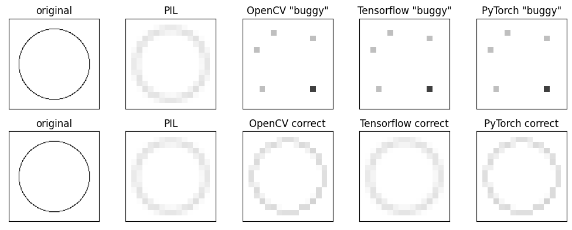

# A Criticism of the Paper [On Buggy Resizing Libraries](https://arxiv.org/abs/2104.11222)

This repository contains:
* a Jupyter notebook for reproducing the aliased image downsampling fenomenon, as demonstrated in the [On Buggy Resizing Libraries](https://arxiv.org/abs/2104.11222) paper, which argues that the image downsampling methods of the [OpenCV](https://docs.opencv.org/4.5.4/da/d54/group__imgproc__transform.html#ga47a974309e9102f5f08231edc7e7529d), [Tensorflow](https://www.tensorflow.org/api_docs/python/tf/image/resize) and [PyTorch](https://pytorch.org/docs/1.10.0/generated/torch.nn.functional.interpolate.html?highlight=interpolate#torch.nn.functional.interpolate) libraries are "buggy", with only [PIL](https://pillow.readthedocs.io/en/stable/reference/Image.html#PIL.Image.Image.resize) being correct.
* simple solutions for antialiasing in every framework, which solves the issue in all cases using the same functions, simply by setting parameters appropriately:
    * OpenCV: change the [interpolation](https://docs.opencv.org/4.5.4/da/d54/group__imgproc__transform.html#ga5bb5a1fea74ea38e1a5445ca803ff121) from bilinear to area (from `cv2.INTER_LINEAR` to `cv2.INTER_AREA`)
    * Tensorflow: set the [antialias flag](https://www.tensorflow.org/api_docs/python/tf/image/resize) to `True`
    * PyTorch: change the [interpolation mode](https://pytorch.org/docs/1.10.0/generated/torch.nn.functional.interpolate.html?highlight=interpolate#torch.nn.functional.interpolate) from `bilinear` to `area`, or simply use [`torchvision.transforms.Resize()`](https://pytorch.org/vision/stable/transforms.html?highlight=torchvision%20transforms%20resize#torchvision.transforms.Resize) instead of [`torch.nn.functional.interpolate()`]((https://pytorch.org/docs/1.10.0/generated/torch.nn.functional.interpolate.html?highlight=interpolate#torch.nn.functional.interpolate))

Try it out in a Colab Notebook: 

My opinion:
* neither of the used image downsampling methods is "buggy", not applying antialiasing by default is an understandable design decision for both image and tensor operations.
* the main figure of the paper is misleading, and it only illustrates the issues of aliasing for image resizing.
* the aliasing issue with downsampling can be solved in all frameworks by simply setting a few parameters correctly. My criticism is that this is not mentioned in the paper.
* `torchvision.transforms.Resize()` is claimed to only be a "a wrapper around the PIL library" in a note in Section 3.2 of the [paper](https://arxiv.org/abs/2104.11222). This is [true for PIL image inputs](https://github.com/pytorch/vision/blob/main/torchvision/transforms/functional.py#L415), but is incorrect for `torch.Tensors`, which are [resized using torchvision interpolation operations](https://github.com/pytorch/vision/blob/main/torchvision/transforms/functional_tensor.py#L480).
* the remaining parts of the paper provide valuable insights into the effects of interpolation methods, quantization and compression on the [FID score](https://arxiv.org/abs/1706.08500) of generative models.

Update: Just found out that there is another, very thorough investigation of the same issue. Highly recommend checking the [blogpost](https://blog.zuru.tech/machine-learning/2021/08/09/the-dangers-behind-image-resizing) out. They also implement an [OpenCV-compatible Pillow-equivalent resizing](https://github.com/zurutech/pillow-resize) that provides proper antialiasing for all interpolations.

Bilinear downsampling results with and without aliasing:

The main figure (Figure 1) of the paper:
 
